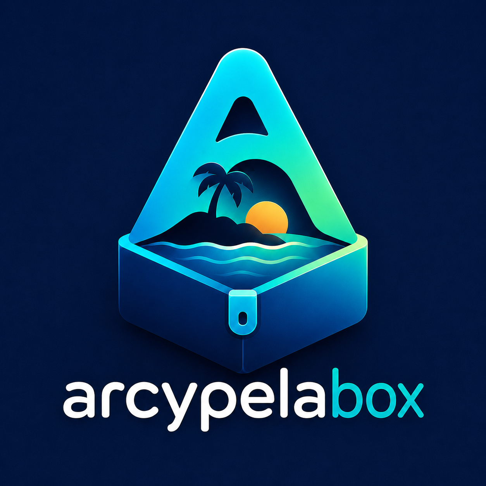
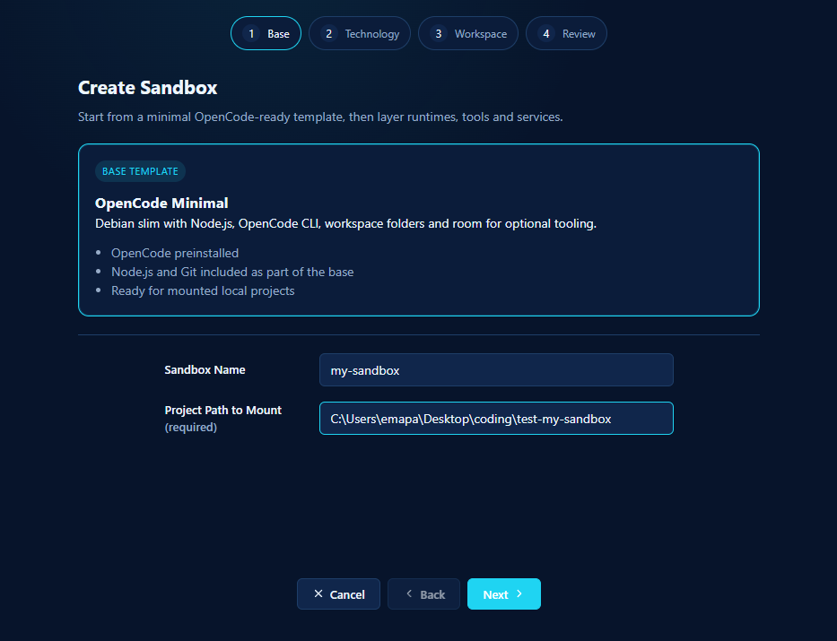
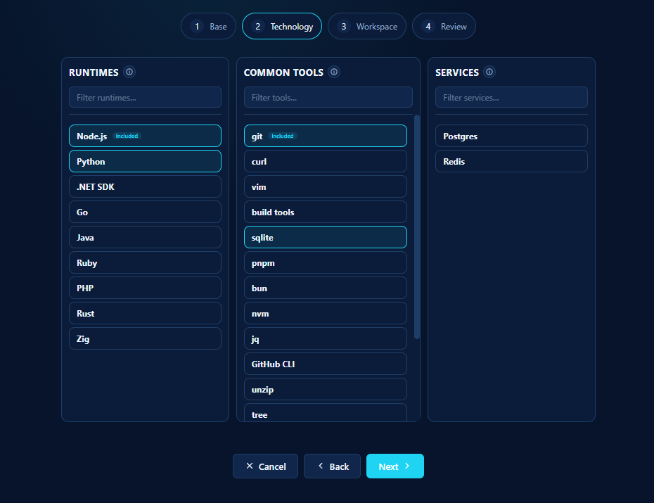
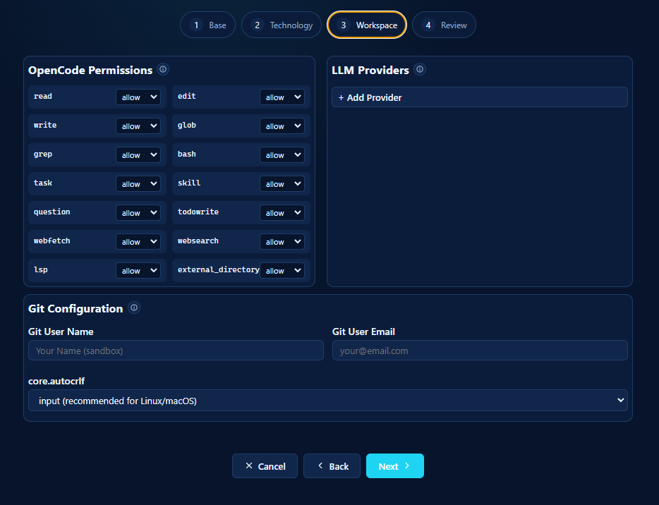
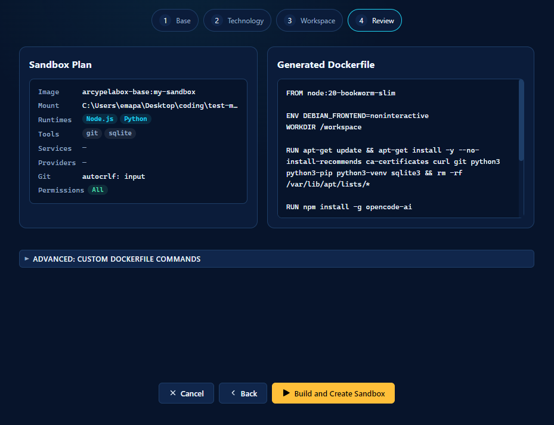
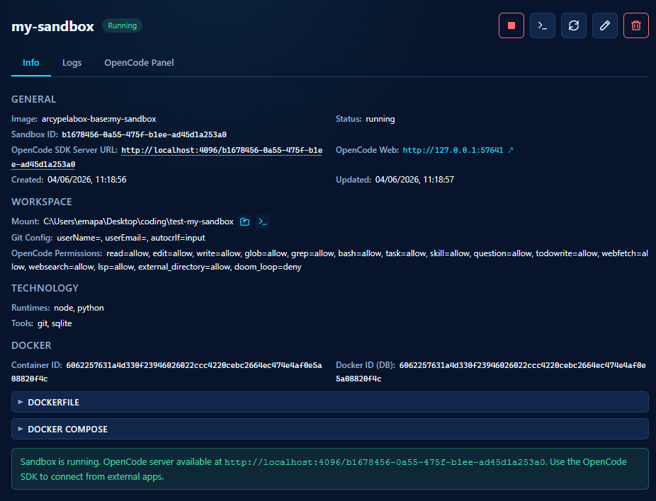
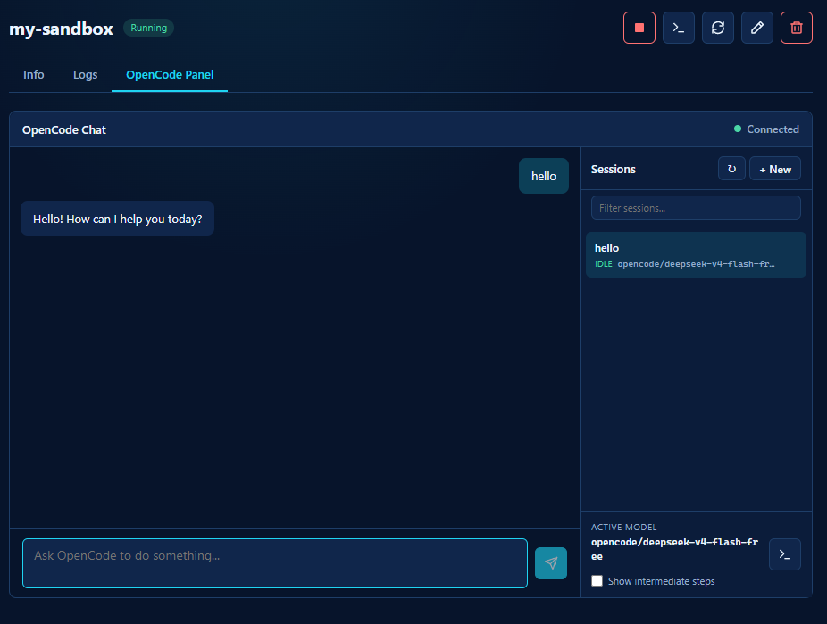

# Arcypelabox

<div align="center">
  
</div>

**Isolated Docker sandboxes for AI coding agents — managed from a desktop app and accessible via APIs.**

Arcypelabox is a cross-platform Electron application that lets you create, configure, and manage secure Docker sandboxes, each running an [OpenCode](https://opencode.ai) AI server. You can think of it as a control center for disposable, reproducible development environments where AI agents work autonomously on your projects.

---

## Key Features

- **Sandbox creation wizard** — 4-step UI to define your sandbox: choose runtimes (Node.js, Python, Go, Java, Rust, etc.), tools (git, curl, vim, pnpm, gh, etc.), and sidecar services (Postgres, Redis).
- **Docker container lifecycle** — Start, stop, delete, and inspect sandboxes and their sidecar containers as a single group.
- **OpenCode AI chat** — Built-in chat panel to interact with the AI agent inside each sandbox. Handle permissions, answer questions, manage multiple sessions, and view debug information.
- **Project bind-mount** — Mount a local project folder into `/workspace` inside the sandbox so the AI agent can work on real code.
- **Reverse proxy** — A single HTTP proxy on `localhost:4096` routes to every sandbox by ID, providing a unified endpoint for the OpenCode SDK and direct HTTP access.
- **Named pipe REST API** — Expose sandbox management endpoints via named pipe (Windows) or Unix socket (Linux/macOS) for integration with other local desktop applications.
- **Sidecar containers** — Optionally provision Postgres and Redis containers on the same Docker network as the sandbox, pre-configured and ready for the AI agent.
- **Provider-agnostic AI** — Configure any LLM provider (Anthropic, OpenAI, DeepSeek, Google, Ollama, and 20+ more) with API keys encrypted using the OS keychain.
- **Security-first** — Mount path validation with symlink scanning, port binding on `127.0.0.1`, `--cap-drop=ALL`, Dockerfile injection blocked via API, API keys never stored in Docker layers.

---

## Quick Preview

### Create Your Sandbox

A 4-step wizard to configure your sandbox environment.

| Step 1 — Base | Step 2 — Technology |
|:---:|:---:|
|  |  |

| Step 3 — Workspace | Step 4 — Review |
|:---:|:---:|
|  |  |

### Manage Your Sandbox

Monitor container status, view logs, and interact with the AI agent.

| Sandbox Info | AI Chat Panel |
|:---:|:---:|
|  |  |

---

## Quick Start

### Prerequisites

- [Node.js](https://nodejs.org/) (v18 or later)
- [npm](https://www.npmjs.com/)
- [Docker Desktop](https://www.docker.com/products/docker-desktop/) or a working Docker Engine

All sandbox operations require Docker to be running locally.

### Install & Run

```bash
# Clone the repository
git clone https://github.com/emaparatore/arcypelabox.git
cd arcypelabox

# Install dependencies
npm install

# Start the full application (renderer + Electron + Vite)
npm run electron:dev
```

The app window opens at 1280x820. In development mode, the renderer is served from Vite's dev server at `http://localhost:5173`.

### Useful Commands

| Command | Description |
|---------|-------------|
| `npm run electron:dev` | Full development (Vite + Electron + TypeScript watcher) |
| `npm run dev` | Vite renderer only on `http://localhost:5173` |
| `npm run dev:electron` | Electron TypeScript watcher only |
| `npm run typecheck` | TypeScript type checking (renderer + Electron) |
| `npm test` | Run the full Vitest suite |
| `npm run test:unit` | Run unit tests under `tests/unit/` |
| `npm run test:integration` | Run integration tests under `tests/integration/` |
| `npm run test:critical-flows` | Run a focused regression pack for high-risk sandbox flows |
| `npm run test:watch` | Start Vitest in watch mode |
| `npm run build` | Production build (`dist/` + `dist-electron/`) |
| `npm run electron:build` | Package as a distributable Electron app (`release/`) |

---

## Architecture Overview

```
┌─────────────────────────────────────────────────────────┐
│                   Electron Main Process                 │
│  ┌──────────┐  ┌──────────┐  ┌─────────┐  ┌─────────┐   │
│  │ docker.ts│  │opencode. │  │proxy.ts │  │ api.ts  │   │
│  │ (Docker) │  │ ts (SDK) │  │ (HTTP   │  │ (Named  │   │
│  │          │  │          │  │  Proxy) │  │  Pipe)  │   │
│  └──────────┘  └──────────┘  └─────────┘  └─────────┘   │
│        │              │             │            │      │
│        ▼              ▼             ▼            ▼      │
│  ┌───────────────────────────────────────────────────┐  │
│  │              IPC Handlers (main.ts)               │  │
│  └──────────────────────┬────────────────────────────┘  │
│                         │ contextBridge                 │
│  ┌──────────────────────▼────────────────────────────┐  │
│  │           Renderer (React + Vite)                 │  │
│  │  SandboxCreate · SandboxDetail · SandboxList      │  │
│  │  OpenCodePanel    ·    BuildProgressModal         │  │
│  └───────────────────────────────────────────────────┘  │
└─────────────────────────────────────────────────────────┘
         │                                        │
         ▼                                        ▼
   ┌──────────┐                          ┌──────────────┐
   │  Docker  │                          │  Named Pipe  │
   │  Engine  │                          │  (localhost  │
   │          │                          │   REST API)  │
   └──────────┘                          └──────────────┘
         │
         ▼
   ┌─────────────────────────────────────┐
   │  Sandbox Container (sandbox-xxx)    │
   │  ┌───────────────────────────────┐  │
   │  │  OpenCode Server              │  │
   │  │  + AI Agents + Tools + SDK    │  │
   │  └───────────────────────────────┘  │
   │        │              |             │
   │  ┌─────┴─────┐  ┌─────┴─────┐       │
   │  │  Postgres │  │   Redis   │       │
   │  │ (sidecar) │  │ (sidecar) │       │
   │  └───────────┘  └───────────┘       │
   └─────────────────────────────────────┘
```

### Project Structure

```
arcypelabox/
├── src/                    # React renderer (UI)
│   ├── App.tsx             # Main app, routing, sidebar
│   ├── components/         # UI components
│   │   ├── SandboxCreate.tsx   # 4-step creation wizard
│   │   ├── SandboxDetail.tsx   # Detail view (Info/Logs/Chat)
│   │   ├── SandboxList.tsx     # Sidebar sandbox list
│   │   ├── OpenCodePanel.tsx   # AI chat panel
│   │   └── ...
│   ├── hooks/              # React hooks
│   ├── types.ts            # Shared TypeScript types
│   └── index.css           # Theme (CSS custom properties)
├── electron/               # Electron main process
│   ├── main.ts             # App entry, window, IPC handlers
│   ├── preload.ts          # contextBridge: window.sandobox
│   ├── docker.ts           # Docker lifecycle, images, sidecars
│   ├── opencode.ts         # OpenCode SDK integration
│   ├── proxy.ts            # HTTP reverse proxy
│   ├── api.ts              # Named pipe REST routes
│   ├── ipc-server.ts       # Named pipe / Unix socket server
│   ├── ipc-client.ts       # Named pipe / Unix socket client
│   └── database.ts         # SQLite (better-sqlite3)
├── docs/                   # Documentation
├── imgs/                   # App icons & logos
├── scripts/                # Utility scripts
├── package.json
├── vite.config.ts
├── tsconfig.json           # Renderer TypeScript config
└── tsconfig.node.json      # Electron TypeScript config
```

---

## Documentation

| Document | Description |
|----------|-------------|
| [User Guide](docs/user-guide.md) | Complete walkthrough of the app interface and features |
| [Architecture](docs/architecture.md) | Deep dive into system architecture and component relationships |
| [Sandbox Creation](docs/create-sandbox.md) | How the 4-step wizard works: runtimes, tools, services, permissions |
| [OpenCode Integration](docs/opencode-integration.md) | How OpenCode runs inside sandboxes: chat, permissions, sessions, providers |
| [API Reference](docs/api-reference.md) | Named pipe REST API: endpoints, protocol, examples |
| [Docker & Sidecars](docs/docker-sidecars.md) | Container lifecycle, image building, Postgres/Redis sidecars, docker-compose |
| [Security Model](docs/security.md) | Mount validation, port security, encryption, container hardening |
| [Development Guide](docs/development.md) | Setup, code conventions, adding features, building |
| [Reverse Proxy](docs/reverse-proxy.md) | HTTP proxy on port 4096: path-based routing, SSE, debug endpoint |

---

## Tech Stack

| Layer | Technology |
|-------|-----------|
| Desktop shell | [Electron](https://www.electronjs.org/) 33 |
| UI framework | [React](https://react.dev/) 19 |
| Build tool | [Vite](https://vitejs.dev/) 6 |
| Docker | [Dockerode](https://github.com/apocas/dockerode) |
| AI SDK | [@opencode-ai/sdk](https://www.npmjs.com/package/@opencode-ai/sdk) |
| Database | [better-sqlite3](https://github.com/WiseLibs/better-sqlite3) |
| Language | [TypeScript](https://www.typescriptlang.org/) 5.6 |

---

## Verification

The fastest meaningful verification is:

```bash
npm run typecheck
```

This checks both the renderer (`tsconfig.json`) and Electron (`tsconfig.node.json`) TypeScript configurations.

For test coverage, the project uses Vitest with three main entry points:

| Command | Scope |
|---------|-------|
| `npm test` | Entire test suite |
| `npm run test:unit` | Unit tests for Electron and renderer modules |
| `npm run test:integration` | Integration tests for IPC, Docker contracts, and renderer flows |
| `npm run test:critical-flows` | Curated regression suite for the most failure-prone flows |

Recommended verification before merging non-trivial changes:

```bash
npm run typecheck
npm run test:unit
npm run test:integration
```

---

## License

Copyright 2026 Emanuele Paratore. Licensed under the [Apache License, Version 2.0](LICENSE).
