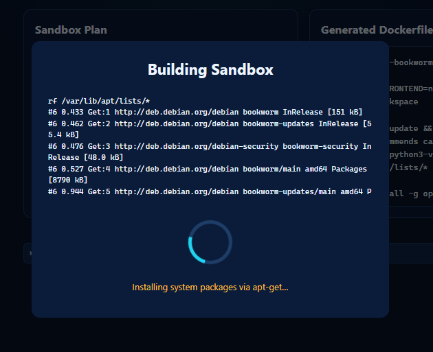

# Docker & Sidecars

## Docker Integration

Arcypelabox uses the **Dockerode** library to manage the full container lifecycle — building images, creating containers, starting/stopping, and cleanup.

### Prerequisites

- Docker Desktop or Docker Engine must be running
- On Windows, the app detects `ENOENT` errors on `//./pipe/docker_engine` and maps them to a friendly "Docker not running" error message

---

## Container Lifecycle

### Image Building

When a sandbox is created or edited:

1. The renderer sends the configuration to the Electron main process via IPC
2. `buildGeneratedDockerfile()` generates a Dockerfile from wizard selections
3. A temporary build directory is created
4. The image is built via the Docker API with progress streamed back to the UI in real-time
5. Success or failure is displayed in the build progress modal

### Container Creation

The `createSandbox()` function in `electron/docker.ts` handles container creation with the following configuration:

**Labels**

| Label | Value |
|-------|-------|
| `sandobox.manager` | `true` |
| `sandobox.id` | UUID |
| `sandobox.name` | User-defined name |

**Networking**

- Port binding: OpenCode server port is bound to `127.0.0.1` only (not publicly accessible)
- All sidecar containers share a common Docker network for DNS-based discovery

**Resource Limits**

| Container | CPU | Memory |
|-----------|-----|--------|
| Main sandbox | 2 cores (2,000,000,000 nano CPUs) | 2 GB |
| Postgres sidecar | 1 core | 512 MB |
| Redis sidecar | 1 core | 512 MB |

These limits are defined as constants at the top of `electron/docker.ts`.

**Volume**

The host project path is bind-mounted to `/workspace` inside the container.

**Security**

- `--cap-drop=ALL`: all Linux capabilities are dropped
- Root filesystem is read-only (except the `/workspace` mount)

**API Key Injection**

API keys for LLM providers are injected via a PostStart API call after the container starts. They are never stored in Docker environment variables or image layers.

**Sidecar Creation**

If Postgres or Redis services are selected, sidecar containers are created on the shared network with the `sandobox.group` label.

### Registering with Proxy

On startup, `registerExistingSandboxes()` scans all containers with the `sandobox.manager=true` label. For each container found, it reads the host port from Docker port bindings or the `sandobox.host.port` label and registers the sandbox with the `SandboxProxy` singleton.

This ensures proxy routes survive application restarts.

### Container Actions

**Start**

Starts the main container and all sidecar containers in the group.

**Stop**

Stops the main container and all sidecar containers. Container data is preserved; only the process is halted.

**Remove**

Removes the main container, the shared Docker network, all sidecar containers, and optionally the Docker image.

---

## Group Operations

Sidecars share the `sandobox.group` label with the main sandbox container. All lifecycle operations (start, stop, remove) operate on the entire group, not individual containers.

**Group network:** All containers are placed on the same Docker network, enabling DNS-based service discovery. The main sandbox can reach sidecars by their hostnames (`postgres`, `redis`).

---

## Resource Limits

| Container | CPU | Memory |
|-----------|-----|--------|
| Main sandbox | 2 cores | 2 GB |
| Postgres sidecar | 1 core | 512 MB |
| Redis sidecar | 1 core | 512 MB |

Resource limits are applied at container creation time and are not user-configurable.

---

## Sidecar Details

### Postgres (16-alpine)

- **Image:** `postgres:16-alpine`
- **Environment variables set on the sidecar:**
  - `POSTGRES_USER=sandbox`
  - `POSTGRES_PASSWORD=sandbox`
  - `POSTGRES_DB=sandbox`
- **Environment variables injected into the main sandbox:**
  - `PGHOST=postgres`
  - `PGPORT=5432`
  - `PGUSER=sandbox`
  - `PGPASSWORD=sandbox`
  - `PGDATABASE=sandbox`

### Redis (7-alpine)

- **Image:** `redis:7-alpine`
- **Environment variables injected into the main sandbox:**
  - `REDIS_HOST=redis`
  - `REDIS_PORT=6379`

Both sidecars are accessible from the main sandbox container via Docker DNS hostnames (`postgres`, `redis`). No additional network configuration is required.

---

## Auto-Recovery

The `tryRecoverSandboxRecord()` function handles a specific edge case: when a Docker container exists (has the `sandobox.manager=true` label) but no corresponding database record is found.

This can happen if:
- The application's database file was deleted or corrupted
- The container was created externally or by a previous application instance

The recovery process:
1. Scans the container's labels to extract ID, name, and port
2. Creates a minimal sandbox record in the database
3. Registers the sandbox with default permissions
4. Adds it to the proxy routing table

Auto-recovery is triggered when the detail view is accessed and the initial database lookup fails.

---

## Docker Watcher

The `startDockerWatcher()` function polls Docker events to detect externally-initiated container changes.

When a sandbox container is created or removed outside the application (e.g., via `docker rm` or `docker-compose`), the watcher:

- Updates proxy registrations for affected sandboxes
- Refreshes the sidebar sandbox list
- Ensures the UI state remains consistent with actual Docker state

The watcher runs continuously while the application is open.

---

## Important Notes

- **`buildDockerCompose()` must stay synchronized with `createSandbox()`.** Both functions produce the same environment (same env vars, network aliases, `cap_drop`, OpenCode serve command, sidecar config). If you modify one, update the other.
- The docker-compose output is **display-only**. It is shown for user reference so they can reproduce the environment manually. It is never consumed programmatically.
- All managed sandbox containers are identified by the `sandobox.manager=true` label. Containers without this label are ignored.
- Project mount validation checks that the path is under the user's home directory and scans for symlinks pointing outside the allowed tree.
